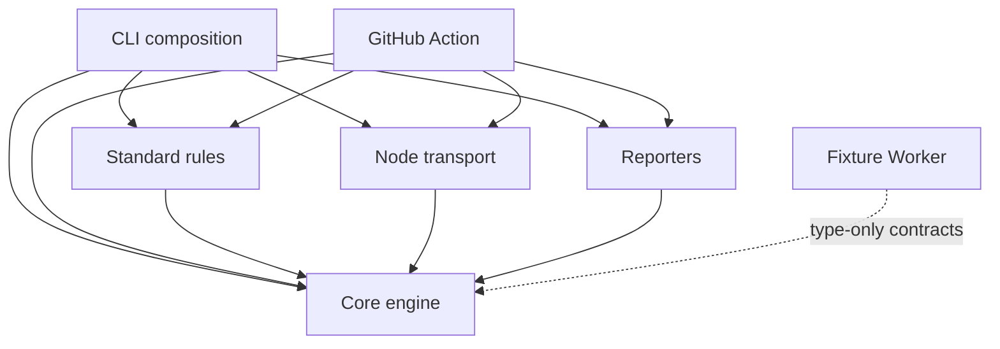
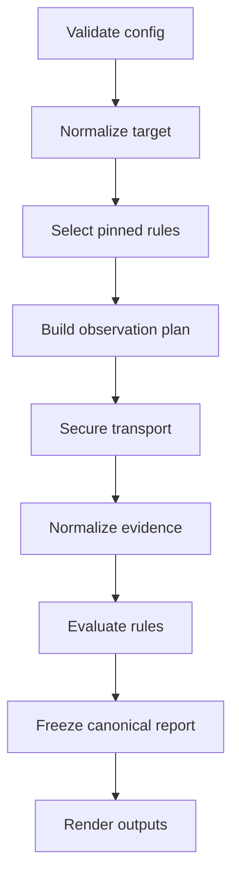

# Architecture

- Status: Proposed
- Snapshot date: 2026-08-28
- Applies to: planned `0.1.x` implementation

## 1. Architectural intent

AgentReady Lab should be small enough for a new contributor to understand and
strict enough that one rule cannot bypass security, change another rule's
evidence, or make output nondeterministic.

The key separation is:

- rules decide what observations they need and evaluate normalized evidence;
- the core schedules and deduplicates observations;
- a dedicated Node transport enforces remote-network policy;
- reporters render an immutable report without rescanning or changing verdicts;
- fixtures behave like real origins but cannot become arbitrary proxies.

## 2. Initial toolchain

The proposed foundation is:

- Node.js 24 LTS;
- pnpm workspaces;
- TypeScript in ESM mode with strict type checking;
- Vitest for unit, contract, integration, and security tests;
- tsup or an equivalently small build layer for packages;
- Wrangler and `@cloudflare/vitest-pool-workers` for the fixture Worker;
- `@vercel/ncc` only for packaging the JavaScript GitHub Action;
- JSON Schema Draft 2020-12 for public configuration and report contracts.

Exact dependency versions belong in the future lockfile. The implementation
must not depend on moving `latest` versions in CI or release workflows.

GitHub's JavaScript Action metadata currently supports `runs.using: node24`;
that should be used when the Action milestone begins.

## 3. Proposed repository layout

```text
apps/
  fixtures-worker/
    src/
      index.ts
      manifest.ts
      cases/
    test/
    wrangler.jsonc
packages/
  core/
    src/
      engine/
      model/
      probe/
      schema/
      util/
  rules-standard/
    src/
      parsers/
      rules/
      profiles/
      data/
  transport-node/
    src/
      safe-fetcher.ts
      resolver.ts
      url-policy.ts
      ip-policy.ts
      network-policy.ts
      redirects.ts
      bounded-body.ts
      budget.ts
  reporters/
    src/
      human.ts
      json.ts
      junit.ts
      github-summary.ts
      sarif.ts
      source-map.ts
  cli/
    src/
      commands/
      config/
      exit-codes.ts
  github-action/
    src/main.ts
    action.yml
    dist/index.js
  testkit/
schemas/
  config-v1.schema.json
  scan-report-v1.schema.json
specs/
docs/
test/
  security/
```

The names are proposed. Changing a package boundary or dependency direction
after M0 requires an ADR.

## 4. Dependency direction



Mandatory constraints:

- `core` imports no `node:*`, filesystem, process, CLI, reporter, Wrangler, or
  Cloudflare-specific modules.
- `rules-standard` never calls global `fetch`, DNS, sockets, filesystem,
  environment variables, clocks, or randomness.
- `transport-node` is the only implementation allowed to make public remote
  target requests.
- `reporters` are pure transforms of an immutable normalized report.
- `cli` and `github-action` compose packages; they do not contain protocol
  assertions.
- `fixtures-worker` must not import a Node-only package.
- Package cycles are prohibited.

## 5. Core scan lifecycle

Version 1 uses serial rule evaluation. The small initial rule set does not
justify nondeterministic global-budget races. A rule declares a sorted batch of
independent observations, which the core executes strictly one at a time.

An earlier revision of this section let the core execute that batch with bounded
concurrency. ADR-0005 withdrew it: reserving request counts alone leaves the
whole-scan byte budgets racing chunk arrival, so `network.maxConcurrency` is
pinned to `1` for M1 and a configuration that sets it higher exits 2 rather than
being silently ignored.



Detailed lifecycle:

1. Parse and schema-validate configuration before any network request.
2. Normalize the absolute HTTP/HTTPS target and reject prohibited syntax.
3. Resolve profile, mode, ruleset, include/exclude selectors, and runtime
   capabilities.
4. Sort enabled rules by stable registry order.
5. Ask each rule for its complete round-one request list through `plan()`, and
   reserve a slot for each distinct canonical request and for each rule's
   declared round-two budget, before any socket opens.
6. Deduplicate identical requests using the canonical request key of section 7.
7. Route observations through the selected transport policy, one at a time, in
   stable plan order.
8. Convert network and parser failures to typed observations; never expose raw
   exceptions to rules or reports.
9. Evaluate rules in deterministic order: `step()` returns either one further
   batch of discovered requests, executed the same way, or the rule's outcomes,
   and `finish()` returns the outcomes of a rule that requested a second round.
10. Sort findings, evidence references, headers, and results.
11. Construct and freeze the canonical report.
12. Pass that report to one or more pure reporters.

Steps 5 and 9 are the two engine-driven rounds of ADR-0002. There is no third
round and no path by which a rule requests an observation imperatively.

## 6. Core interfaces

The interfaces below illustrate responsibilities. They are not generated source
files and may be refined during M0 without changing the product contract. The
`Source*` unions are the vocabulary the independent source ledger records for
each pinned source (ADR-0008) and that `RuleMetadata.sources` carries forward.

```ts
export type RuleStatus =
  | "pass"
  | "fail"
  | "warning"
  | "not-applicable"
  | "unable-to-check"
  | "unsupported-runtime";

export type RequirementClass =
  | "normative"
  | "recommended"
  | "advisory"
  | "compatibility";

export type SourceKind =
  | "compatibility-contract"
  | "ietf-rfc"
  | "ietf-draft"
  | "openid-specification"
  | "industry-protocol"
  | "standards-organization"
  | "w3c-community-report"
  | "ecosystem-specification"
  | "vendor-convention"
  | "open-source-profile"
  | "open-proposal";

export type SourceStatus =
  | "compatibility-snapshot"
  | "internet-standard"
  | "proposed-standard"
  | "informational-rfc"
  | "final"
  | "active-draft"
  | "expired-draft"
  | "open-pr"
  | "proposal"
  | "beta"
  | "community-report"
  | "convention"
  | "living-specification";

export type SourceMaturity =
  | "stable"
  | "mixed"
  | "draft"
  | "experimental"
  | "convention"
  | "beta";

export type ObservationRuntime = "http" | "dns" | "browser";

export interface RuleDefinition<Options = unknown> {
  readonly apiVersion: 1;
  readonly metadata: RuleMetadata;
  readonly defaultOptions: Readonly<Options>;
  plan(input: PlanInput<Options>): readonly ObservationRequest[];
  step(context: RoundContext<Options>): RequestBatch | AssertionOutcomes;
  finish(context: RoundContext<Options>): AssertionOutcomes;
}

export interface RoundContext<Options> extends PlanInput<Options> {
  /** Resolves a rule-local request id from any completed round. */
  observation(id: string): ProbeObservation;
  /** Deeply frozen shared parse result. The loader is synchronous. */
  memo<T>(namespacedKey: string, load: () => T): T;
}
```

A rule is three pure synchronous functions over exactly two engine-driven
rounds. None of them returns a promise, receives an `AbortSignal`, or observes
time. `plan()` runs before any socket opens and returns the rule's complete
round-one request list. `step()` returns either one ordered batch of discovered
requests or the rule's final assertion outcomes. `finish()` runs only for a rule
whose `step()` returned a batch, and cannot request anything further.

ADR-0002 declares the rest of that contract and this section does not copy it:
`RuleMetadata`, `PlanInput`, `ObservationRequest`, `ProbeObservation`,
`AssertionOutcome`, `RequestBatch`, `AssertionOutcomes`, and the per-assertion
declarations the core validates outcomes against.

An earlier revision of this section described an asynchronous `RuleV1` whose
`evaluate()` reached the transport through `RuleContextV1.probe()` and
`probeAll()`. ADR-0002 withdrew that design: imperative probing makes
plan-time budget reservation impossible, defeats the M0 criterion that an
invalid configuration performs no transport call, and lets a rule observe
response completion order. `RuleV1`, `RuleContextV1`, `probe`, and `probeAll`
no longer exist.

Synchronicity is a scheduling and determinism property and not a sandbox.
ADR-0002 section 2 records the import allowlist, restricted globals, dependency
inspection, and throwing-global harness that actually keep rule code away from
I/O, the clock, and randomness, and it states that no release gate may rely on
the signature as if it were a capability boundary.

Registry fields project into `RuleMetadata` through the mapping table in
ADR-0002 section 10: native `id` comes from `rule_id`,
`externalCompatibilityId` comes from the separate camelCase `id` and is `null`
for a native rule with no external counterpart, `ruleVersion` comes from
`rule_version`, `sourceMaturity` comes from `maturity`, and
`observationRuntime` comes from `runtime`. Runtime values describe required
observation capabilities; they do not permit rule packages to perform I/O.
`implementationStatus` comes from the native ruleset manifest (ADR-0008) and
from nowhere else.

Evaluators return assertion outcomes, not findings. The core derives every
status from the ruleset's immutable class mapping, derives citations from the
assertion declaration, renders prose from a static template, and constructs
`RuleFinding` and `RuleResult`. A rule cannot choose a status, a requirement
class, a message string, or a source reference.

Rule IDs and assertion/finding codes are public API. A semantic change increments
the rule version and ruleset version. Retired IDs remain reserved.

The registry's separate camelCase `id` is an external compatibility key and
belongs only in compatibility-adapter metadata; it is never the native report or
CLI identifier.

## 7. Observation planning and memoization

The canonical request key is defined in full by ADR-0005 section 3. Its
components are:

```text
METHOD
+ effective URL, fragment removed
+ sorted multi-valued representation-affecting request headers
+ redirect policy
+ effective maximum redirect count
+ effective maxEncodedBytes
+ effective maxDecodedBytes
+ network scope and network profile id
```

An earlier revision of this section defined the key here and named a single
"body limit". `HttpObservationRequest` carries `maxEncodedBytes` **and**
`maxDecodedBytes` (ADR-0002 section 4), so a singular limit let two requests
differing only in one of the two safety limits canonicalize onto one key: the
rule that lowered a limit would be handed the other rule's larger, or truncated,
response. Both limits are now in the key, as effective values after the
minimum-across-sources rule of ADR-0004 section 9, and the key lives with the
limits it protects.

Version 1 permits only GET and HEAD and has no request body, so `accept` is the
only representation-affecting header a rule can set. The header component is
still modeled as a sorted multi-valued set, for the same reason this section
once modeled a request-body digest: a later addition must not be able to create
a silent collision.

Two examples that must not deduplicate:

- `GET /` with `Accept: text/html`;
- `GET /` with `Accept: text/markdown`.

Shared parsing belongs in a namespaced memo. The robots, AI crawler rule, and
Content Signals rule should share one fetched and parsed representation instead
of implementing three parsers.

```ts
const robots = context.memo("agentready-lab/parsed-robots/v1", () =>
  parseRobots(context.observation("robots")),
);
```

Memo access is synchronous, like everything else a rule runs. Memo loaders must
be deterministic and must not hide a larger network budget. ADR-0002 section 11
validates a memo result as acyclic plain data and deeply freezes it before
caching it, which is what makes section 1's promise that one rule cannot change
another rule's evidence true of a shared parse.

## 8. Error model

Transport failures are typed, and ADR-0003 defines the vocabulary. There are two
enumerations. The public one is the 15-member `PublicObservationError.code` in
section 9; it is the only error vocabulary in the canonical report and in every
reporter. The internal one is a single `ObservationFailure` union declared in
`packages/core` and built from three owner-specific unions, `TransportReason`,
`ParserReason`, and `EngineReason`; it never appears in a report. Core declares
it because `rules-standard` and `transport-node` both depend on core and neither
depends on the other.

This section previously declared a 10-member `TransportErrorCode`. It was an
orphan that matched neither the boundary it claimed to describe nor the report
it fed, and ADR-0003 retires it.

Rules receive a normalized failure observation. They do not catch arbitrary
socket exceptions. A document the target served that is merely wrong is not an
observation failure: a parse the harness refused or aborted is `parse-failed` or
`resource-budget-exhausted`, while bytes this project parsed well enough to know
were invalid are a conformance finding.

Examples:

- a confirmed same-origin `404` on a required endpoint may produce `fail`;
- DNS failure, timeout, TLS failure, truncated response, or blocked redirect
  produces `unable-to-check` or aborts the scan according to the budget policy;
- lack of a browser runtime produces `unsupported-runtime`, not a WebMCP fail;
- an invalid JSON document returned successfully can produce `fail` if the rule
  is applicable and the selected version requires JSON.

## 9. Canonical report and metadata envelope

The canonical report must be deterministic. It omits wall-clock timestamps,
random IDs, and durations. Optional operational metadata belongs in an outer
envelope enabled by `--include-metadata`.

```ts
interface CanonicalScanReportV1 {
  schemaVersion: "1.0.0";
  tool: { name: "agentready-lab"; version: string };
  ruleset: { id: string; version: string; digest: string };
  /** `source_ledger_version` of `specs/sources.v0.yaml`. */
  sourceLedgerVersion: string;
  /** Present in `compat` mode and absent in every other mode. */
  externalSnapshot?: ExternalSnapshotRef;
  profile: { id: string; version: string };
  mode: "spec" | "compat" | "interop";
  target: {
    requestedUrl: string;
    resolvedPageUrl: string;
    origin: string;
    scope: "local" | "remote";
    networkProfile: "local-loopback" | "ci-public" | "hosted-public";
  };
  policy: PublicNetworkPolicy;
  summary: ScanSummary;
  results: readonly RuleResult[];
  /** Every selected rule's validated options, sorted by `ruleId`. */
  effectiveOptions: readonly EffectiveRuleOptions[];
  evidence: readonly PublicEvidence[];
  /** The pinned sources a finding in this report cites, sorted by `id`. */
  sources: readonly ReportSource[];
}

interface ExternalSnapshotRef {
  /** `snapshot.captured_at` of `specs/checks.v0.yaml`. */
  capturedAt: string;
  /** `schema_version` of that file. */
  schemaVersion: string;
}

interface ReportSource {
  id: string;
  title: string;
  url: string;
  kind: string;
  status: string;
  version?: string;
  verifiedAt: string;
}

type EffectiveOptionValue =
  | { kind: "boolean"; value: boolean }
  | { kind: "integer"; value: number }
  | { kind: "string"; value: string }
  | { kind: "string-list"; value: readonly string[] }
  | { kind: "redacted" };

interface EffectiveRuleOptions {
  ruleId: string;
  /** Every validated option key for this rule, sorted by key. */
  options: Readonly<Record<string, EffectiveOptionValue>>;
}

interface PublicNetworkPolicy {
  id: "local-loopback" | "ci-public" | "hosted-public";
  version: string;
  allowedSchemes: readonly ("http" | "https")[];
  allowedPorts: readonly number[];
  maxRequests: number;
  maxRedirectsPerObservation: number;
  maxEncodedResponseBytes: number;
  maxDecodedResponseBytes: number;
  sameOriginDiscovery: boolean;
}

interface ScanSummary {
  pass: number;
  fail: number;
  warning: number;
  notApplicable: number;
  unableToCheck: number;
  unsupportedRuntime: number;
}

interface RuleResult {
  ruleId: string;
  ruleVersion: string;
  status: RuleStatus;
  /** Only an `enforced` result reaches the exit code. */
  gate: "enforced" | "informational";
  findings: readonly RuleFinding[];
}

/** Constructed by the core. A rule never builds one. */
interface RuleFinding {
  code: string;
  mode: "spec" | "compat" | "interop";
  requirementClass: RequirementClass;
  status: RuleStatus;
  message: string;
  /** Present on every `fail` and `warning`, absent otherwise. */
  remediation?: {
    class:
      | "required-correction"
      | "recommended-hardening"
      | "compatibility-workaround";
    summary: string;
  };
  sourceRefs: readonly {
    sourceId: string;
    section?: string;
  }[];
  evidenceRefs: readonly string[];
}

type PublicEvidence = PublicHttpEvidence | PublicDnsEvidence | PublicBrowserEvidence;

interface PublicObservationError {
  code:
    | "url-policy-blocked"
    | "dns-resolution-failed"
    | "dns-answer-blocked"
    | "connect-timeout"
    | "connection-failed"
    | "tls-failed"
    | "request-timeout"
    | "redirect-limit"
    | "request-budget-exhausted"
    | "resource-budget-exhausted"
    | "response-limit"
    | "decode-failed"
    | "parse-failed"
    | "aborted"
    | "unsupported-runtime";
  phase:
    | "policy"
    | "dns"
    | "connect"
    | "tls"
    | "request"
    | "redirect"
    | "body"
    | "decode"
    | "parse"
    | "runtime";
  message: string;
  retryable: boolean;
}

interface PublicHttpEvidence {
  id: string;
  kind: "http";
  request: {
    method: "GET" | "HEAD";
    url: string;
    headers: Readonly<Record<string, readonly string[]>>;
  };
  outcome:
    | {
        kind: "response";
        status: number;
        headers: Readonly<Record<string, readonly string[]>>;
        encodedBytes: number;
        decodedBytes: number;
        bodySha256: string;
        truncated: boolean;
        redirects: readonly {
          status: number;
          location: string;
          decision: "followed" | "blocked";
        }[];
      }
    | { kind: "error"; error: PublicObservationError };
}

interface PublicDnsEvidence {
  id: string;
  kind: "dns";
  query: { name: string; recordType: string };
  outcome:
    | {
        kind: "answer";
        rcode: string;
        records: readonly { type: string; value: string }[];
        dnssec: "secure" | "insecure" | "bogus" | "indeterminate";
      }
    | { kind: "error"; error: PublicObservationError };
}

interface PublicBrowserEvidence {
  id: string;
  kind: "browser";
  action: { url: string; capability: string };
  outcome:
    | {
        kind: "observation";
        facts: readonly {
          key: string;
          value: string | number | boolean | null;
        }[];
      }
    | { kind: "error"; error: PublicObservationError };
}

interface ReportEnvelopeV1 {
  report: CanonicalScanReportV1;
  metadata?: {
    generatedAt: string;
    durationMs: number;
  };
}
```

One `RuleResult` represents one selected rule. Its `status` is derived from its
findings, not chosen independently. The fixed precedence is `fail`,
`unable-to-check`, `unsupported-runtime`, `warning`, `pass`, then
`not-applicable`. A `not-applicable` finding cannot coexist with an evaluated
finding. This lets one rule retain both a passing normative assertion and a
recommendation warning while its overall status is `warning`.

`gate` is a separate axis from `status`. Only an `enforced` result reaches the
exit code, and `--strict-warnings` and `--strict-unable` do not promote an
`informational` one (ADR-0004 section 4). An informational result still appears
in `results`, still counts in `summary`, and still carries its findings and
evidence, so a reader who sees `fail: 1` beside exit code 0 can explain it from
the report alone.

`ScanSummary` counts rule results by their derived status, never individual
findings. Results sort by registry order and rule ID; findings sort by stable
code; evidence sorts by ID. Findings reference top-level evidence by ID, so
sanitized observations are deduplicated and never embedded inconsistently in
individual results.

The report is self-contained about what decided it. `sources` carries the pinned
sources a finding in this report actually cites, projected from the source
ledger at build time and filtered to those citations; a finding citing a
`sourceId` absent from that array is a contract-test failure, and no source URL
is resolved during a scan or at report time. `sourceLedgerVersion` and, in
`compat` mode only, `externalSnapshot` name the two version axes that
`ruleset.version` does not. `effectiveOptions` records the complete validated
option set of every selected rule, including values that came from
`defaultOptions`, because a rule can request the identical resource under
different options and reach a different verdict, and a canonical report that
cannot account for its own differences is not reusable evidence. `remediation`
is present on every `fail` and `warning` and its text lives in
`specs/remediation.v0.yaml`, keyed by finding code, never in rule source.
ADR-0007 and ADR-0004 section 8 govern these fields.

Evidence IDs are `ev-` followed by a three-digit zero-padded decimal, assigned
per round in stable plan order once that round's plan is frozen (ADR-0005
section 5). An earlier revision of this section made them hashes of the
canonical sanitized observation and its body digest; they are not, and an
anonymous reservation slot is not an evidence ID either. The content digest
keeps living in `bodySha256`. Sorting evidence by ID is therefore sorting by
plan order, and because IDs shift when the plan changes, `report diff` compares
evidence through the findings that reference it, keyed by `(ruleId,
findingCode)`, never by raw evidence ID.

Evidence headers are multi-valued. A single-valued `Record<string, string>`
cannot represent the two `Link` field lines that fixture `lnk-001` requires,
which ADR-0002 records as a defect in this section. The rule-facing
`HttpObservation` uses `ReadonlyMap<string, readonly string[]>`; the report
carries the same correction in a JSON-serializable form.

Each observation kind has a discriminated success-versus-error outcome. A
blocked destination, DNS failure, timeout, TLS failure, redirect limit,
exhausted budget, or unsupported runtime is represented by a stable typed error;
the report must never fabricate a response. Evidence contains only bounded
facts, a safe header allowlist, body length and digest, truncation state, and
redirect decisions. Complete bodies, raw DNS packet bytes, DOM snapshots, and
raw stacks are excluded.

`hosted-public` stays in `target.networkProfile` and in `PublicNetworkPolicy.id`
although `--network-profile` accepts only `local-loopback` and `ci-public`.
ADR-0008 section 6 records that inconsistency and deliberately leaves the report
and policy types unchanged: a value that can be serialized into a report but
never selected is either a premature type or a missing flag, and hosted scanning
needs its own decision first. ADR-0002 removed the value from the rule-facing
target descriptor for the same reason, which is why it no longer appears in
section 6.

## 10. Configuration

Version 1 uses non-executable JSON, tentatively `agentready.config.json`.
Executable JavaScript/TypeScript configuration is prohibited in the MVP.

```json
{
  "$schema": "./schemas/config-v1.schema.json",
  "profile": "content@0.1.0",
  "mode": "spec",
  "ruleset": "0.1.0",
  "rules": {
    "disable": [],
    "options": {}
  },
  "network": {
    "profile": "ci-public",
    "maxRequests": 24,
    "maxConcurrency": 1,
    "dnsTimeoutMs": 2000,
    "connectTimeoutMs": 3000,
    "perRequestTimeoutMs": 10000,
    "totalTimeoutMs": 30000,
    "maxEncodedResponseBytes": 1048576,
    "maxDecodedResponseBytes": 2097152,
    "maxTotalEncodedBytes": 4194304,
    "maxTotalDecodedBytes": 8388608,
    "maxRedirects": 5
  },
  "report": {
    "sourceMap": {
      "/robots.txt": "public/robots.txt",
      "/.well-known/api-catalog": "public/.well-known/api-catalog"
    }
  }
}
```

This example previously carried a `rules.severity` object and
`"maxConcurrency": 2`. ADR-0004 section 7 removes `severity` from the schema: a
set of per-rule weights is the aggregate score ADR-0001 forbids, and it would
let configuration promote a `recommended` requirement to `fail` against the
class recorded in the registry. `--strict-warnings` and `--strict-unable` cover
the legitimate use. ADR-0005 section 1 pins `maxConcurrency` to `1` for M1;
whether the key is removed from the schema or reactivated at `ci-public` is
recorded as an open question there.

`rules.options` is typed, not free-form. Each rule publishes a JSON Schema for
its options beside the rule, unknown keys exit 2, and validation happens before
any transport call.

Configuration validation occurs before network access. Repository source-map
paths reject absolute paths and `..`. `--debug` may print the effective
configuration only after secret and query-value redaction. For every security
budget in `THREAT_MODEL.md` section 16 the effective value is the minimum across
all sources: configuration and rule options may lower a budget and may never
raise one.

## 11. Network transports

### 11.1 In-memory transport

The default unit-test transport returns explicitly constructed observations. It
never opens a socket. Most core and rule tests use this transport.

### 11.2 Local-loopback transport

The local profile allows only the exact developer-supplied loopback origin.
Redirects and discovered resources remain same-origin. Private LAN ranges are
not implicitly allowed. Supporting a named private development host requires an
explicit future policy and tests.

### 11.3 Public remote Node transport

The remote transport is implemented in `transport-node`. It:

- parses and canonicalizes with the WHATWG URL model;
- rejects credentials, prohibited protocols, and unsafe ports;
- resolves every A and AAAA answer;
- rejects any special-use/private answer and mixed public/private sets;
- pins the actual socket to an approved address while preserving Host and TLS
  SNI;
- follows redirects manually and repeats the full policy at every hop;
- verifies the connected peer where the selected library permits;
- ignores ambient proxy variables for target traffic;
- attaches no cookies or authorization credentials;
- strips sensitive headers across origin changes;
- enforces streaming time, request, redirect, compressed-byte, and
  decompressed-byte budgets.

An ordinary Web `fetch` preceded by a DNS check does not satisfy these
requirements because it cannot prove which address the socket used.

### 11.4 Browser observation

Browser execution is outside the MVP. When added, browser traffic must use an
equivalent egress boundary. It cannot bypass `transport-node` simply because a
browser API is convenient. Page JavaScript and tool descriptions are hostile
data and never become instructions to the scanner or Claude Code.

### 11.5 Hosted execution

A generic public scanning Worker is deferred. A Worker can perform a separate
DNS lookup, but that does not by itself prove that the subsequent platform
request used the approved address. A hosted demo may safely serve the project's
own fixed fixtures. Accepting arbitrary user URLs requires a separately reviewed
egress design, authentication, rate limits, abuse controls, and privacy policy.

## 12. Parser boundaries

Each parser is a pure, size-bounded function over normalized bytes and metadata.

- JSON parsing is data-only and followed by schema/semantic validation.
- XML parsers must not resolve DTDs, external entities, or network resources.
- Link headers require an RFC-aware parser; splitting on commas is insufficient.
- Media types are parsed case-insensitively with parameter handling.
- Text decoding uses a declared, tested policy and reports replacement/error
  behavior.
- Regexes over hostile input require bounded input and review for pathological
  backtracking.

Downloaded Agent Skills archives are not unpacked in the MVP. In interop mode,
the raw artifact may be streamed and hashed. Future archive inspection needs a
separate path traversal, link, file-count, and decompression policy.

## 13. Fixture architecture

The fixture source is a declarative manifest compiled into one Worker handler
and one in-memory/local test adapter.

Each scenario inherits a known-good base and overrides a minimal behavior.

```ts
defineFixture({
  id: "markdown-wrong-type",
  expected: {
    "web.content.markdown-negotiation": "fail",
  },
  overrides: {
    "/": negotiate({
      "text/markdown": response({
        status: 200,
        headers: { "content-type": "text/html" },
        body: "# Wrong media type",
      }),
    }),
  },
});
```

Public fixtures should use real root paths through wildcard subdomains only
after the maintainer owns and configures a domain. Example names in documents
are illustrative and must not be deployed verbatim.

Fixture constraints:

- fixed compile-time cases;
- no query-driven arbitrary status, body, or redirect destination;
- no open redirect and no proxy behavior;
- unique manifest IDs and host labels;
- intentional caching headers only in caching fixtures;
- a metadata endpoint may expose fixture ID and source commit, not secrets;
- local and deployed behavior share the same handler;
- ordinary pull requests test locally; deployed smoke tests are scheduled and
  non-blocking.

## 14. Reporters

All reporters are pure functions.

### Human

- deterministic rule order;
- works without color and honors `NO_COLOR`;
- separates required failures from recommendations;
- bounds and sanitizes untrusted strings.

### JSON

- validates against the committed schema;
- stdout contains JSON only;
- diagnostics go to stderr;
- canonical output omits optional volatile metadata by default.

### JUnit

- one rule per `<testcase>`;
- fail maps to `<failure>`;
- unable/unsupported maps to `<error>` unless configuration chooses skipped;
- not-applicable maps to `<skipped>`;
- untrusted text is correctly XML-escaped and bounded.

### GitHub Summary

- primary GitHub user experience;
- summarizes regressions and improvements;
- caps annotations to avoid flooding;
- needs no pull-request write permission.

### SARIF

- emits SARIF 2.1.0;
- stable rule IDs and fingerprints;
- only creates actionable code-scanning locations through explicit source map;
- does not disguise a remote URL as a source file.

## 15. GitHub Action

The Action calls the libraries directly rather than spawning the CLI. It is a
thin adapter over the same configuration, engine, rules, transport, and
reporters.

Security behavior:

- designed for `pull_request`, not unsafe `pull_request_target` execution;
- minimal read-only token permissions by default;
- no secrets exposed to untrusted fork code;
- no pull-request comment by default;
- writes Job Summary and output paths;
- leaves artifact and SARIF upload to explicit workflow steps;
- packaged output is generated and verified in CI;
- third-party rule plugins remain disabled.

## 16. Optional compatibility adapters

An external-scanner adapter lives outside core and rules. It may call only a
documented endpoint, is disabled by default, rate-limited, cached, and labeled
with provider and observation date.

The adapter produces an observation report. It cannot override native verdicts
or declare either implementation automatically correct. Differences are
reported as candidates for reproduction against a controlled fixture.

## 17. Plugin policy

Rule interfaces should avoid blocking a future plugin API, but v1 does not load
arbitrary third-party code. A JavaScript plugin is trusted code in the scanner
process; it is not “safe” because it uses an interface.

A future plugin milestone needs:

- explicit installed package allowlist;
- API version handshake;
- namespace enforcement;
- schema validation of metadata and returned results;
- exception isolation;
- prominent trust documentation;
- Action opt-in;
- contract test kit.

## 18. Tooling and planned root commands

These commands become authoritative only after M0 implements and tests them:

```text
pnpm build
pnpm typecheck
pnpm lint
pnpm format:check
pnpm test
pnpm test:unit
pnpm test:integration
pnpm test:security
pnpm check
pnpm fixtures:dev
pnpm fixtures:deploy
pnpm action:package
pnpm action:verify
```

External deployment and publication commands always require explicit human
approval.

## 19. Architecture acceptance tests

M0/M1 must prove:

- a build-time rule prevents Node imports from `core` and `rules-standard`;
- a rule cannot access a real network in unit tests;
- invalid config makes zero network requests;
- two representation-different probes do not deduplicate;
- identical probes deduplicate across rules;
- response arrival order does not change canonical JSON;
- raw transport exceptions never enter the public report;
- reporters cannot mutate a frozen report;
- source-map traversal and absolute paths are rejected;
- `local-loopback` rejects a redirect away from the exact loopback origin;
- public transport adversarial cases pass before remote scan is advertised.

## 20. Related decisions

- [ADR-0001: Scope, modes, and no aggregate score](decisions/0001-scope-modes-and-scoring.md)
- [ADR-0002: Rule execution model and observation types](decisions/0002-rule-execution-model.md)
- [ADR-0003: Unified transport error vocabulary](decisions/0003-transport-error-vocabulary.md)
- [ADR-0004: Rule selection, applicability, and opt-in](decisions/0004-rule-selection-and-applicability.md)
- [ADR-0005: Determinism and evidence identity](decisions/0005-determinism-and-evidence-identity.md)
- [ADR-0007: Report self-containment, sources and remediation](decisions/0007-report-self-containment.md)
- [ADR-0008: Registry extensibility and the missing assertions](decisions/0008-registry-extensibility.md)
- [Threat model](THREAT_MODEL.md)
- [Test strategy](TEST_STRATEGY.md)
- [Implementation specification](IMPLEMENTATION_SPEC.md)
