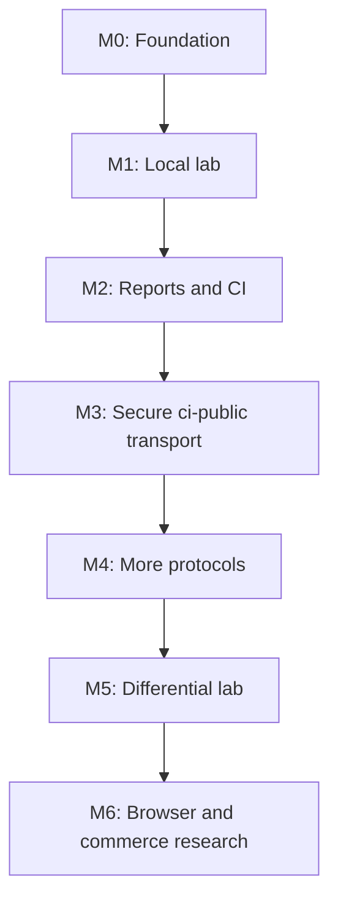

# Roadmap

- Status: Proposed
- Snapshot date: 2026-08-28
- Current phase: Phase 0 — reviewed implementation blueprint

> [!IMPORTANT]
> Roadmap items are plans, not shipped features. Check `PROJECT_STATUS.md` for
> the current implementation state. No milestone is complete until its code,
> deterministic tests, documentation, and status update are merged together.

## 1. Sequencing principle

AgentReady Lab is local-first. The roadmap deliberately establishes trustworthy
rule semantics and fixtures before `ci-public` networking, CI presentation, broader
protocols, browser execution, commerce, or a public hosted service.

There is no aggregate percentage score or certification level in this roadmap.
The product reports rule statuses, explicit applicability, source versions, and
sanitized evidence. Adding a score requires a separate accepted ADR.

## 2. Milestone rules

Every milestone follows these rules:

- one issue or pull request should implement one bounded acceptance slice;
- verdict-changing work begins with a pinned source and fixtures;
- a bug fix includes a failing regression test;
- ordinary CI never depends on the public Internet;
- no milestone may weaken a prior security boundary;
- future commands and packages are described as planned until tested;
- `PROJECT_STATUS.md` is updated only after verification;
- deployment, package publication, and external writes require explicit human
  approval.

## 3. M0 — Repository foundation

### Outcome

A clean Node.js 24/pnpm/strict-TypeScript workspace with enforceable package
boundaries, public result/config contracts, deterministic test infrastructure,
and no real network scanning.

### Deliverables

- pnpm workspace and committed lockfile;
- Node.js 24 development baseline and ESM packages;
- strict shared TypeScript configuration;
- package skeletons for `core`, `rules-standard`, `transport-node`, `reporters`,
  `cli`, `github-action`, and `testkit`, plus the fixture Worker;
- JSON Schema Draft 2020-12 source for config and canonical report;
- minimal immutable result types and canonical serializer;
- in-memory observation transport and fixed-clock test utilities;
- format, lint, typecheck, unit-test, and build scripts;
- CI with frozen dependency installation and no external network dependency;
- package-boundary check preventing Node/global-network imports in core/rules;
- documentation and contribution scaffolding consistent with actual status.

### Acceptance criteria

- [ ] A clean clone on Node.js 24 can run the documented M0 check command.
- [ ] Two builds and two canonical test serializations are byte-identical.
- [ ] Invalid sample configuration validates as invalid without a transport call.
- [ ] `core` compiles for a Web-platform runtime without Node imports.
- [ ] A deliberately forbidden import fails the boundary test.
- [ ] No command can scan a real URL yet.
- [ ] Package manifests do not advertise unimplemented binaries or releases.
- [ ] `PROJECT_STATUS.md` is updated in the completion pull request.

### Explicitly deferred

Rules, loopback HTTP, `ci-public` target I/O, GitHub Action behavior, deployment, npm
publication, dynamic plugins, and hosted scanning.

## 4. M1 — Deterministic local lab

### Outcome

A developer can scan an exact loopback preview with eight built-in rules and
receive deterministic human and JSON reports. No public target can be scanned.

### Deliverables

- exact-origin `local-loopback` transport for `127.0.0.1` and `[::1]`;
- serial deterministic rule engine with representation-aware request
  deduplication and namespaced memoization;
- eight-rule MVP:
  1. Robots Exclusion Protocol;
  2. sitemap discovery;
  3. HTTP Link discovery;
  4. Markdown negotiation;
  5. AI crawler policy;
  6. Content Signals;
  7. API Catalog;
  8. Agent Skills Discovery v0.2.0;
- pinned rule metadata, source references, assertion IDs, and independent
  remediation text;
- declarative fixture manifest and known-good base origin;
- at least the 49 protocol cases in `FIXTURE_CATALOG.md`;
- Workers-runtime tests for the same fixed handler, without requiring a public
  deployment;
- human and canonical JSON reporters;
- initial CLI commands: `check`, `rules list`, and `rules explain`;
- tested exit codes and strictness handling;
- request, body, redirect, and total scan budgets for local execution.

### Acceptance criteria

- [ ] All 49 protocol fixture contracts pass locally.
- [ ] All M1 security/boundary fixtures pass.
- [ ] The `local-loopback` transport rejects redirects away from the exact supplied origin.
- [ ] HTML and Markdown observations of the same URL never deduplicate.
- [ ] Robots, AI crawler, and Content Signals rules share one robots observation.
- [ ] Dispatch order is plan order and latency does not move it: request N+1 is
      not dispatched before request N settles, and canonical JSON is
      byte-identical across per-response latency profiles.
- [ ] Reversed and re-segmented chunk arrival does not change canonical JSON,
      including a segmentation where the byte that crosses a whole-scan
      threshold arrives alone as the final chunk.
- [ ] Every assertion/finding code has a positive and negative test.
- [ ] Complete response bodies, credentials, cookies, and raw exceptions are
      absent from reports.
- [ ] Human output works without color and JSON stdout contains JSON only.
- [ ] CLI help and exit behavior have golden tests.
- [ ] The `ci-public` profile exits as an unsupported/configuration condition and makes no
      public connection.
- [ ] Version `0.1.0` release criteria in `IMPLEMENTATION_SPEC.md` are satisfied
      before calling the CLI usable.

The two dispatch criteria replace "Reordering promise completion does not change
canonical JSON", which named a mechanism this design does not have. Under
ADR-0005 a later observation is not dispatched until the earlier one has
settled, and ADR-0002 makes rules synchronous, so there is no rule-facing
promise to reorder. What that criterion reached for is now structural; latency
and chunk segmentation are the free variables the tests permute instead.

### Release opportunity

After M1, the project may publish an explicitly experimental `local-loopback`-only
`0.1.0`. Public fixture hosting is optional and does not expand scanner egress.

## 5. M2 — Report and CI contracts

### Outcome

Repositories can run the proven local scanner against their own preview server
and receive portable, regression-aware CI output.

### Deliverables

- JUnit reporter;
- GitHub Job Summary and bounded workflow annotations;
- SARIF 2.1.0 reporter requiring explicit repository source mapping;
- canonical report diff command;
- config, report, and ruleset compatibility tests;
- thin JavaScript GitHub Action packaged with `@vercel/ncc` and
  `runs.using: node24`;
- Action inputs/outputs for target, config, strictness, reports, and baseline;
- maintained example workflow using `pull_request`, read-only permissions, and
  no repository secret exposure to fork code;
- Action bundle reproducibility check;
- artifact examples that leave upload decisions to explicit workflow steps.

### Acceptance criteria

- [ ] JSON validates against the committed schema.
- [ ] JUnit parses correctly and reports exact counts.
- [ ] SARIF validates and creates code locations only through a safe source map.
- [ ] Traversal and absolute source-map paths fail before scanning.
- [ ] Unmapped remote-style findings are not presented as repository files.
- [ ] Job Summary remains complete when annotations are capped.
- [ ] Diff refuses semantic comparison across incompatible schema/profile/mode/
      ruleset versions unless raw comparison is explicitly requested.
- [ ] The Action calls project libraries rather than spawning an unpinned CLI.
- [ ] The committed Action bundle is reproducible and current.
- [ ] No PR comment or write permission is required by default.

### Explicitly deferred

Secure arbitrary public targets, PR comments, executable plugins, and public
multi-user scanning.

## 6. M3 — Secure `ci-public` transport

### Outcome

The Node CLI can scan an explicitly supplied public HTTP(S) origin through a
reviewed transport boundary that resists SSRF, DNS rebinding, redirect pivots,
and resource exhaustion.

### Deliverables

- WHATWG URL canonicalization and explicit public-network policy;
- all-answer A/AAAA resolution and IANA special-use address classification;
- rejection of mixed public/private address sets;
- connection pinning to an authorized IP while preserving Host and TLS SNI;
- manual redirect following with full policy revalidation at every hop;
- unsafe-port policy;
- no ambient proxy credentials, cookies, or authorization;
- streamed compressed/decompressed response limits;
- request, byte, redirect, connect, elapsed, and whole-scan budgets;
- normalized transport error model and sanitized debug behavior;
- complete M3 adversarial suite from `FIXTURE_CATALOG.md`;
- transport-focused dependency and security review.

### Acceptance criteria

- [ ] All M3 security fixtures and table-driven special-use IP cases pass.
- [ ] Tests prove the connected socket uses an authorized resolved address.
- [ ] Every redirect is independently resolved and authorized.
- [ ] DNS validation followed by an unpinned ordinary `fetch()` is not used.
- [ ] A compressed expansion cannot exceed the decoded byte budget.
- [ ] No ambient proxy/cookie/auth data reaches a target.
- [ ] A blocked target produces typed, sanitized evidence.
- [ ] The `ci-public` profile remains off by default until a maintainer records independent
      security review and updates `PROJECT_STATUS.md`.

### Explicitly deferred

A browser runtime and generic hosted arbitrary-URL scanning. Cloudflare Workers
fixture hosting does not by itself satisfy the Node connection-pinning model.

## 7. M4 — Protocol expansion

### Outcome

Add carefully pinned discovery and authentication families without destabilizing
the eight-rule MVP.

### Candidate order

1. MCP Server Card, after its discovery proposal has a pinned implementable
   snapshot;
2. A2A Agent Card;
3. OAuth Authorization Server Metadata;
4. OAuth Protected Resource Metadata;
5. DNS-AID, after DNS transport and DNSSEC semantics are designed;
6. Web Bot Auth discovery;
7. Auth.md;
8. Agentic Resource Discovery.

### Entry criteria for each rule

- exact primary source, version/commit, section, and license/provenance record;
- applicability and mode decision;
- no mutating/authenticated operation;
- valid, invalid, absent, media-type, redirect, and version-drift fixtures;
- parser limits and evidence-redaction review;
- accepted rule proposal issue;
- no duplicate of stronger existing conformance tooling without a documented
  integration or comparison reason.

### Acceptance criteria

- [ ] Each added rule passes the standards-update process.
- [ ] Old pinned rulesets reproduce their prior reports.
- [ ] New draft versions do not silently change old rule semantics.
- [ ] Browser-only behavior reports `unsupported-runtime` outside a browser.
- [ ] Rule count does not produce or imply an aggregate score.

## 8. M5 — Controlled differential lab

### Outcome

Generate reproducible evidence about differences between local, origin, edge,
and optional external-scanner observations.

### Deliverables

- vantage-point labels in an observation envelope;
- compatible report comparison and evidence-only change detection;
- local-versus-deployed fixture matrix;
- optional adapter for documented external scanner endpoints, outside core;
- provider/date/ruleset labels and raw-to-normalized mapping tests;
- rate limiting, caching, and manual/scheduled execution;
- an exportable regression bundle: fixture, expected result, sources, native
  report, external observation, and reproduction steps.

### Acceptance criteria

- [ ] Differential output never overrides the native conformance verdict.
- [ ] A difference is labeled an implementation difference, not automatically a
      bug in either tool.
- [ ] External access is opt-in and never merge-blocking.
- [ ] Calls use documented endpoints and do not circumvent service limits.
- [ ] At least one real discrepancy can be reproduced entirely with a controlled
      fixture before publication as a case study.

## 9. M6 — Browser and commerce research

### Outcome

Explore capabilities that materially increase execution and abuse risk only
after the static/`local-loopback`/`ci-public` foundations are mature.

### Browser work

- choose an isolated browser runtime and egress design through a separate ADR;
- ensure subresources, service workers, redirects, WebSockets, and page scripts
  cannot bypass target policy;
- treat page content and tool descriptions as hostile data, never instructions;
- implement WebMCP observation without invoking tools.

### Commerce work

- begin with static discovery document validation only;
- require explicit commerce profile/endpoint selection;
- never make a payment, create an order, register an identity, or call a
  state-changing operation;
- create a separate threat and privacy review for every interaction mode;
- prefer protocol-owned conformance suites when available.

### Acceptance criteria

- [ ] Browser egress has parity with the approved `ci-public` transport policy.
- [ ] No discovered script, skill, API operation, or payment instruction is
      executed.
- [ ] Commerce absence remains `not-applicable` outside an explicit profile.
- [ ] Each experimental rule is visibly labeled and excluded from default
      failure policy unless an ADR changes that decision.

Neither browser nor commerce support is required for a useful `1.0.0`.

## 10. Hosted-service decision gate

A fixed public Worker that serves project-owned fixtures may be deployed after
M1. A public service that accepts arbitrary URLs is a different product and is
not scheduled by the milestones above.

Before arbitrary hosted scanning, require a separate accepted ADR covering:

- an egress mechanism that closes DNS/connect time-of-check/time-of-use gaps;
- authentication and per-user/per-target rate limiting;
- abuse detection and a reporting channel;
- target authorization expectations;
- queueing and resource quotas;
- logging, retention, deletion, and privacy disclosure;
- incident response and service shutdown controls;
- legal/terms review;
- operational ownership and cost limits.

Do not treat “it runs on Workers” as proof of this trust boundary.

## 11. `1.0.0` readiness criteria

Version `1.0.0` does not require M4–M6. It requires a trustworthy stable core:

- M0–M2 complete;
- M3 complete if `ci-public` scanning is included in `1.0.0` marketing;
- public schema and Rule API stability policy;
- at least two prior experimental releases with upgrade testing;
- no unresolved release-blocking security issue;
- repeatable package provenance and rollback procedure;
- documented support window for Node.js and rulesets;
- contributor workflow exercised by at least one external contribution;
- maintainers can update a draft rule without rewriting unrelated packages;
- documentation and examples contain no unimplemented claim;
- no aggregate score or certification implication without a later accepted ADR.

## 12. Suggested issue sequence for Claude Code

Avoid asking Claude Code to implement an entire milestone. A safe initial issue
sequence is:

1. scaffold pnpm/Node 24/strict TypeScript without runtime features;
2. add public status/result types and schema tests;
3. add canonical serialization and determinism tests;
4. add in-memory transport and observation contracts;
5. add import-boundary tests;
6. build one `robots.txt` parser vertical slice;
7. build its first six fixtures and contract tests;
8. add the `local-loopback` adapter;
9. add human/JSON output for that one rule;
10. repeat one rule family at a time.

Every Claude Code task should identify allowed files, required tests, explicit
non-goals, and the status document that must remain accurate.

## 13. Milestone ledger

| Milestone | State | Completion evidence |
| --- | --- | --- |
| M0 — Repository foundation | Not started | None; blueprint only |
| M1 — Deterministic local lab | Not started | None |
| M2 — Report and CI contracts | Not started | None |
| M3 — Secure `ci-public` transport | Not started | None |
| M4 — Protocol expansion | Not started | None |
| M5 — Controlled differential lab | Not started | None |
| M6 — Browser and commerce research | Not started | None |

Update this ledger and `PROJECT_STATUS.md` only after the relevant acceptance
criteria have been verified in CI.
